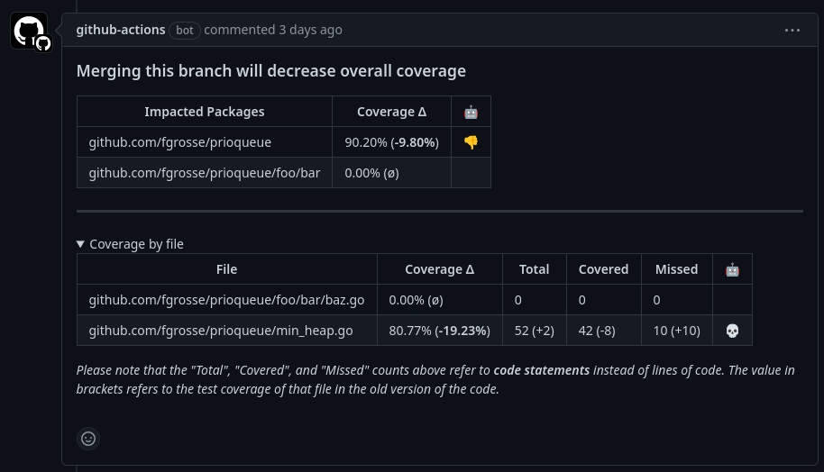

<h1 align="center">Go Coverage Report</h1>
<p align="center">A CLI tool and GitHub Action to post Go code coverage reports as comment to your pull requests.</p>
<p align="center">
    <a href="https://github.com/fgrosse/go-coverage-report/releases"></a>
    <a href="https://github.com/fgrosse/go-coverage-report/actions/workflows/ci.yml"></a>
    <a href="https://github.com/fgrosse/go-coverage-report/blob/master/LICENSE"></a>
</p>

--- 

`go-coverage-report` is a **command line tool** and a **GitHub Action** that
parses code coverage results to create a tabular code coverage report. This
markdown report is intended as pull request comment both to highlight the
impact of the changes on the code coverage on all updated packages and to 
motivate the contributors to write tests for their code.

The provided tool and GitHub Action work without any third-party services
which makes them fast, secure and very easy-to-setup in your own CI/CD pipeline.

## Example

Example of a pull request comment created by `go-coverage-report`:



Please note that by default, the "Coverage by file" section is collapsed so the focus
is more on the overall impact on the coverage _per package_.

There is no indicator of the _total_ coverage of the project because the impact by
changed package is typically a better indicator of the quality of the changes.
Additionally, looking at coverage changes by package is more motivating as code coverage improvements are more pronounced (i.e. typically larger percentage values) when zooming
into the package level, instead of comparing changes on the project level.

The last column is an emoji "score" that is based on the coverage change of the package.
The following emojis are used:

* :star2: - The coverage of the package increased by > 20%
* :tada: - The coverage of the package increased by <= 20%
* :thumbsup: - The coverage of the package increased by <= 10%
* :thumbsdown: - The coverage of the package decreased by <= 10%
* :skull: - The coverage of the package decreased by > 10%, every 10% add another skull (up to five skulls)

## Usage

The `go-coverage-report` tool ships with a **GitHub Action** that you can easily
include in your own Workflows:

```yaml
name: CI

# This setup assumes that you run the unit tests with code coverage in the same
# workflow that will also print the coverage report as comment to the pull request. 
# Therefore, you need to trigger this workflow when a pull request is (re)opened or
# when new code is pushed to the branch of the pull request. In addition, you also
# need to trigger this workflow when new code is pushed to the main branch because 
# we need to upload the code coverage results as artifact for the main branch as
# well since it will be the baseline code coverage.
# 
# We do not want to trigger the workflow for pushes to *any* branch because this
# would trigger our jobs twice on pull requests (once from "push" event and once
# from "pull_request->synchronize")
on:
  pull_request:
    types: [opened, reopened, synchronize]
  push:
    branches:
      - 'main'

jobs:
  unit_tests:
    name: "Unit tests"
    runs-on: ubuntu-latest
    steps:
      - name: Checkout repository
        uses: actions/checkout@v4

      - name: Setup Go
        uses: actions/setup-go@v4
        with:
          go-version: ^1.22

      # When you execute your unit tests, make sure to use the "-coverprofile" flag to write a 
      # coverage profile to a file. You will need the name of the file (e.g. "coverage.txt")
      # in the next step as well as the next job.
      - name: Test
        run: go test -cover -coverprofile=coverage.txt ./...

      - name: Archive code coverage results
        uses: actions/upload-artifact@v4
        with:
          name: code-coverage
          path: coverage.txt # Make sure to use the same file name you chose for the "-coverprofile" in the "Test" step

  code_coverage:
    name: "Code coverage report"
    if: github.event_name == 'pull_request' # Do not run when workflow is triggered by push to main branch
    runs-on: ubuntu-latest
    needs: unit_tests # Depends on the artifact uploaded by the "unit_tests" job
    permissions:
      contents:      read  # to download code coverage results from unit_tests job
      pull-requests: write # write permission needed to comment on PR
    steps:
      - uses: fgrosse/go-coverage-report@v1.0.2 # Consider using a Git revision for maximum security
        with:
          coverage-artifact-name: "code-coverage" # can be omitted if you used this default value
          coverage-file-name: "coverage.txt" # can be omitted if you used this default value
```


### Inputs

<!-- Could use embedmd like this: [embedmd]:# (action.yml yaml /inputs:/ /# end of inputs/) -->
```yaml
inputs:
  version:
    description: 'The exact version of the go-coverage-report tool to use.'
    required: true
    default: "v1.0.2"

  sha256sum:
    description: 'Optional SHA256 checksum of the tarball when downloading the go-coverage-report binary.'
    required: false

  coverage-artifact-name:
    description: 'The name of the artifact containing the code coverage results.'
    required: true
    default: "code-coverage"

  coverage-file-name:
    description: 'The name of the file containing the code coverage results.'
    required: true
    default: "coverage.txt"

  root-package:
    description: |
      The Go import path of the tested repository to add as a prefix to all paths of the
      changed files. This is useful to map the changed files (e.g., ["foo/my_file.go"]
      to their coverage profile which uses the full package name to identify the files
      (e.g., "github.com/fgrosse/example/foo/my_file.go"). Note that currently, 
      packages with a different name than their directory are not supported.
    required: false
    default: "github.com/${{ github.repository }}"

  trim:
    description: Trim a prefix in the "Impacted Packages" column of the markdown report.
    required: false

  skip-comment:
    description: 'If set, skip creating or updating the PR comment.'
    required: false
    default: 'false'
```

### Outputs

This action provides the following output:

- `coverage_report`: The generated coverage report in markdown format.

This output can be used whether or not `skip-comment` is set.

## Limitations

- Currently, code coverage profiles are uploaded as GitHub artifacts which automatically expire after 90 days.
  In a repository which receives changes only infrequently, this might lead to issues when trying to compare
  the code coverage of a pull request with the code coverage of the main branch (see fgrosse/go-coverage-report#5).  
- Support **for forks** is limited since the necessary `GITHUB_TOKEN` permissions don't allow to post comments to the
  pull request of the base repository (see fgrosse/go-coverage-report#15). If forks are important for you, this action
  might not be the best solution.
- Packages with a name that differs from their directory on disk are not supported yet.
- Requires `actions/upload-artifact` >= **v4** (see this [issue][upload-artifacts-issues]).

## Built With

* [tj-actions/changed-files](https://github.com/tj-actions/changed-files) - A GitHub Action to get the list of changed files in pull requests
* [pkg/errors](https://github.com/pkg/errors) - Simple error handling primitives
* [testify](https://github.com/stretchr/testify) - A simple unit test library
* _[and more][built-with]_

## Contributing

Please read [CONTRIBUTING.md](CONTRIBUTING.md) for details on our code of
conduct and on the process for submitting pull requests to this repository.

## Versioning

We use [SemVer](http://semver.org/) for versioning.
All significant (e.g. breaking) changes are documented in the [CHANGELOG.md](CHANGELOG.md).
A list of all available versions can be found at the [releases page][releases].

## Authors

- **Friedrich Große** - *Initial work* - [fgrosse](https://github.com/fgrosse)

- See also the list of [contributors][contributors] who participated in this project.

## License

This project is licensed under the BSD-3-Clause License - see the [LICENSE](LICENSE) file for details.

[releases]: https://github.com/fgrosse/go-coverage-report/release
[contributors]: https://github.com/fgrosse/go-coverage-report/contributors
[built-with]: go.mod
[upload-artifacts-issues]: https://github.com/cli/cli/issues/5625#issuecomment-1857787634
